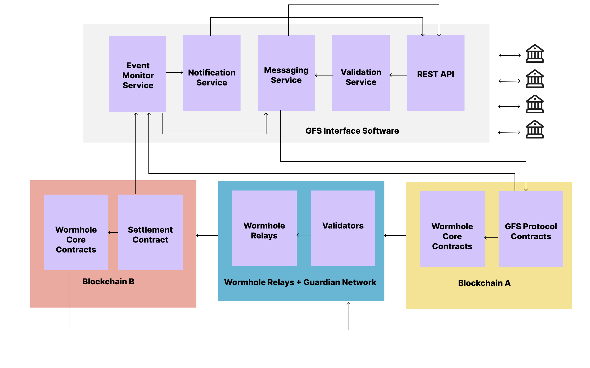

# GFS Protocol: Decentralized ISO20022 Messaging Network
<!-- [](https://opensource.org/licenses/MIT)
[]()
[]()
[]()
 -->


> A decentralized ISO20022 messaging protocol for cross-chain financial communication, powered by Wormhole.

## Table of Contents

- [Overview](#overview)
- [Architecture](#architecture)
- [Getting Started](#getting-started)
  - [Prerequisites](#prerequisites)
  - [Installation](#installation)
  - [Configuration](#configuration)
- [Usage](#usage)
  - [Contract Deployment](#contract-deployment)
  - [Running Tests](#running-tests)
  - [Local Development](#local-development)
- [Core Components](#core-components)
- [Documentation](#documentation)
- [Security](#security)
- [Contributing](#contributing)
- [License](#license)
- [Contact](#contact)


## Overview

GFS Protocol enables standardized financial messaging between traditional financial institutions and blockchain networks through ISO20022-compliant message exchange. By leveraging Wormhole's cross-chain communication infrastructure, GFS provides:

- 🌐 Cross-chain ISO20022 message routing
- 💱 Standardized settlement mechanisms
- 🔒 Regulatory compliance
- ⚡ Efficient message processing
- 🤝 Financial institution integration

## Architecture

### Protocol Stack

<!-- ```mermaid
graph TD
    A[Financial Institutions] -- > B[Protocol Layer]
    B -- > C[Registry Layer]
    B -- > D[Processing Layer]
    B -- > E[Settlement Layer]
    C -- > F[Message Registry]
    C -- > G[Target Registry]
    D -- > H[Message Router]
    D -- > I[Message Processor]
    E -- > J[Settlement Controller]
    E -- > K[Liquidity Pool]
    H -- > L[Wormhole Network]
```
 -->
### Message Flow


<!-- ```mermaid
sequenceDiagram
    participant FI as Financial Institution
    participant PR as Protocol Layer
    participant WH as Wormhole
    participant TC as Target Chain

    FI->>PR: Submit ISO20022 Message
    PR->>PR: Validate & Transform
    PR->>WH: Cross-Chain Delivery
    WH->>TC: Execute & Confirm
    TC->>FI: Delivery Status
``` -->

## Getting Started

### Prerequisites

- Node.js v18+
- Yarn or npm
- Hardhat
- Foundry (for local development)

```bash
# Install Node.js dependencies
npm install

# Install Foundry
curl -L https://foundry.paradigm.xyz | bash
foundryup
```

### Installation

1. Clone the repository:
```bash
git clone https://github.com/gfs-protocol/gfs-core.git
cd gfs-core
```

2. Install dependencies:
```bash
npm install
```

3. Copy environment file:
```bash
cp .env.example .env
```

4. Set up your environment variables:
```env
PRIVATE_KEY=your_private_key
INFURA_API_KEY=your_infura_key
ETHERSCAN_API_KEY=your_etherscan_key
```

### Configuration

The project uses Hardhat and hardhat-deploy for deployment management. Configuration files:

- `hardhat.config.ts`: Network and plugin configuration
- `deploy/`: Deployment scripts
- `.env`: Environment variables

## Usage

### Contract Deployment

Deploy to testnet:

```bash
npx hardhat deploy --network fuji
```

Deploy to mainnet:

```bash
npx hardhat deploy --network avalanche
```

Verify contracts:

```bash
npx hardhat etherscan-verify --network avalanche
```

### Running Tests

```bash
# Run all tests
npx hardhat test

# Run specific test file
npx hardhat test test/MessageRouter.test.ts

# Run tests with coverage
npx hardhat coverage
```

### Local Development

1. Start local node:
```bash
npx hardhat node
```

2. Deploy contracts:
```bash
npx hardhat deploy --network localhost
```

## Core Components

| Contract | Description | Key Functions |
|----------|-------------|---------------|
| MessageRegistry | Message storage and tracking | `registerMessage()`, `getMessage()` |
| TargetRegistry | Participant management | `registerTarget()`, `validateTarget()` |
| MessageRouter | Cross-chain message routing | `routeMessage()`, `deliverMessage()` |
| MessageProcessor | Message handling and execution | `processMessage()`, `registerHandler()` |
| SettlementController | Cross-chain settlement | `initiateSettlement()`, `completeSettlement()` |
| LiquidityPool | Settlement liquidity management | `lockLiquidity()`, `releaseLiquidity()` |

## Documentation

- [Protocol Specification](docs/SPECIFICATION.md)
- [API Documentation](docs/API.md)
- [Integration Guide](docs/INTEGRATION.md)
- [Deployment Guide](docs/DEPLOYMENT.md)

## Security

The protocol undergoes rigorous security measures:

- Comprehensive test coverage
- Multiple external audits
- Regular security reviews
- Bug bounty program

For security concerns, please email security@gfs.protocol

## Contributing

We welcome contributions! Please see our [Contributing Guidelines](CONTRIBUTING.md).

1. Fork the repository
2. Create your feature branch
3. Commit your changes
4. Push to the branch
5. Create a Pull Request

## License

This project is licensed under the MIT License - see the [LICENSE](LICENSE) file for details.

## Contact

- Website: [gfs.protocol](https://gfs.protocol)
- Documentation: [docs.gfs.protocol](https://docs.gfs.protocol)
- Discord: [discord.gg/gfs-protocol](https://discord.gg/gfs-protocol)
- Twitter: [@GFSProtocol](https://twitter.com/GFSProtocol)