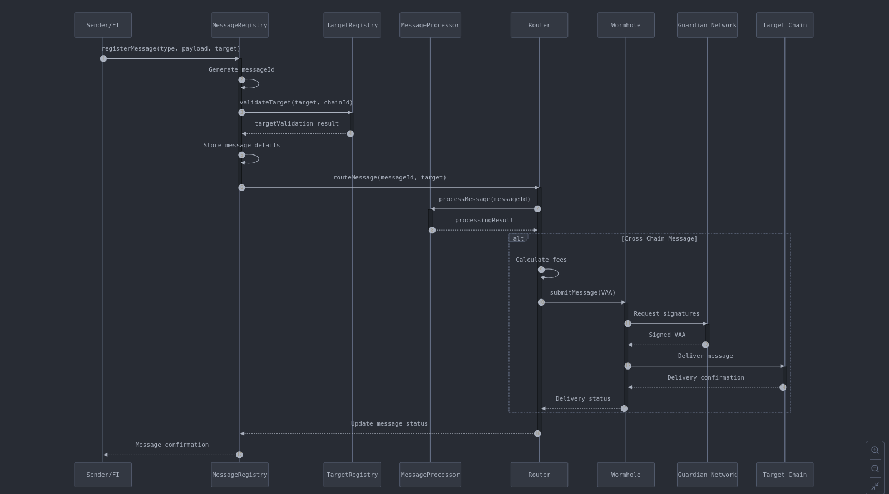

# ISO20022 Messaging Protocol Technical Specification
Version: 1.0.0

## Table of Contents
1. Protocol Overview
2. Core Contract Architecture
3. Contract Interactions
4. Message Flow & Processing
5. Settlement Architecture
6. Wormhole Integration
7. Security Considerations

## 1. Protocol Overview

### 1.1 Purpose
The protocol enables secure, decentralized ISO20022 message exchange between financial institutions and smart contracts across different blockchain networks using Wormhole as the cross-chain communication layer.

### 1.2 Core Components
```plaintext
A. Registry Layer
   - MessageRegistry: Message storage and tracking
   - TargetRegistry: Participant management

B. Processing Layer
   - MessageRouter: Message routing and delivery
   - MessageProcessor: Message-specific handling
   
C. Settlement Layer
   - SettlementController: Cross-chain settlement management
   - LiquidityPool: Settlement liquidity management

D. Protocol Layer
   - MessageProtocol: Message standards and validation
   - ProtocolGovernance: Protocol management and control
```

## 2. Core Contract Architecture

### 2.1 Registry Layer

#### 2.1.1 MessageRegistry
```solidity
contract MessageRegistry is IMessageRegistry {
    // Internal storage
    mapping(bytes32 => ISO20022Message) private messages;
    mapping(address => bytes32[]) private senderMessages;
    mapping(address => bytes32[]) private targetMessages;
    
    // Core functionality
    function registerMessage(...) {
        // 1. Generate unique messageId
        // 2. Store message details
        // 3. Update indices
        // 4. Emit MessageRegistered event
    }
}
```

#### 2.1.2 TargetRegistry
```solidity
contract TargetRegistry is ITargetRegistry {
    // Internal storage
    mapping(address => Target) private targets;
    mapping(uint16 => address[]) private chainTargets;
    mapping(TargetType => address[]) private typeTargets;
    
    // Core functionality
    function registerTarget(...) {
        // 1. Validate target details
        // 2. Store target information
        // 3. Update indices
        // 4. Emit TargetRegistered event
    }
}
```

### 2.2 Processing Layer

#### 2.2.1 MessageRouter
```solidity
contract MessageRouter is IMessageRouter, TokenSender {
    // Wormhole integration
    IWormhole public immutable wormhole;
    
    // Core routing function
    function routeMessage(...) {
        if (targetChain == currentChain) {
            _routeLocal(messageId, target, payload);
        } else {
            _routeCrossChain(messageId, target, targetChain, payload);
        }
    }
    
    // Cross-chain routing via Wormhole
    function _routeCrossChain(...) {
        // 1. Package message with VAA
        // 2. Submit to Wormhole
        // 3. Track delivery status
    }
}
```

#### 2.2.2 MessageProcessor
```solidity
contract MessageProcessor is IMessageProcessor {
    // Handler registry
    mapping(bytes32 => address) private messageHandlers;
    
    function processMessage(...) {
        // 1. Validate message
        // 2. Determine processing action
        // 3. Execute handler
        // 4. Update status
    }
}
```

### 2.3 Settlement Layer

#### 2.3.1 SettlementController
```solidity
contract SettlementController is ISettlementController, TokenSender {
    // Wormhole integration
    ITokenBridge public immutable tokenBridge;
    
    function initiateSettlement(...) {
        // 1. Lock tokens
        // 2. Create settlement record
        // 3. Initiate cross-chain transfer
        // 4. Track settlement status
    }
    
    function _handleCrossChainSettlement(...) {
        // 1. Verify VAA
        // 2. Process token transfer
        // 3. Update settlement status
    }
}
```

#### 2.3.2 LiquidityPool
```solidity
contract LiquidityPool is ILiquidityPool {
    // Pool management
    mapping(address => PoolInfo) private pools;
    mapping(bytes32 => TokenPair) private tokenPairs;
    
    function lockLiquidity(...) {
        // 1. Verify availability
        // 2. Lock requested amount
        // 3. Update pool status
    }
}
```

## 3. Contract Interactions

### 3.1 Message Registration & Routing Flow

<!-- ```mermaid
sequenceDiagram
    participant Sender
    participant MR as MessageRegistry
    participant TR as TargetRegistry
    participant MP as MessageProcessor
    participant Router
    participant WH as Wormhole
    
    Sender->>MR: Register Message
    MR->>TR: Validate Target
    MR->>Router: Request Routing
    Router->>MP: Process Message
    
    alt Cross-Chain Message
        Router->>WH: Submit VAA
        WH-- >>Router: Delivery Status
    end
``` -->

### 3.2 Settlement Flow

<!-- ```mermaid
sequenceDiagram
    participant MP as MessageProcessor
    participant SC as SettlementController
    participant LP as LiquidityPool
    participant TB as TokenBridge
    participant WH as Wormhole
    
    MP->>SC: Request Settlement
    SC->>LP: Lock Liquidity
    SC->>TB: Initiate Transfer
    TB->>WH: Create VAA
    WH-- >>SC: Settlement Status
``` -->

## 4. Message Flow & Processing

### 4.1 Local Message Processing
1. Message Registration
   ```solidity
   function processLocalMessage(bytes32 messageId, bytes memory payload) {
       // 1. Validate message exists
       require(messageRegistry.messageExists(messageId));
       
       // 2. Get message details
       ISO20022Message memory message = messageRegistry.getMessage(messageId);
       
       // 3. Process via appropriate handler
       address handler = messageProcessor.getHandler(message.messageType);
       
       // 4. Execute handler
       IMessageHandler(handler).handle(message);
   }
   ```

### 4.2 Cross-Chain Message Processing
1. Message Packaging
   ```solidity
   function packageCrossChainMessage(
       bytes32 messageId,
       bytes memory payload
   ) internal returns (bytes memory) {
       return abi.encode(
           messageId,
           payload,
           block.timestamp
       );
   }
   ```

2. Wormhole Integration
   ```solidity
   function sendCrossChainMessage(
       uint16 targetChain,
       address targetContract,
       bytes memory payload
   ) internal returns (bytes32) {
       return sendMessageToEvm(
           targetChain,
           targetContract,
           payload,
           0, // refundAmount
           250_000 // gasLimit
       );
   }
   ```

## 5. Settlement Architecture

### 5.1 Settlement Controller Logic
```solidity
function initiateCrossChainSettlement(
    bytes32 settlementId,
    address token,
    uint256 amount,
    uint16 targetChain,
    address recipient
) internal {
    // 1. Lock liquidity
    liquidityPool.lockLiquidity(token, amount, settlementId);
    
    // 2. Transfer tokens via TokenBridge
    tokenBridge.transferTokens{value: msg.value}(
        token,
        amount,
        targetChain,
        recipient
    );
    
    // 3. Track settlement
    settlements[settlementId] = Settlement({
        status: SettlementStatus.IN_PROGRESS,
        // ... other fields
    });
}
```

### 5.2 Settlement Processing
```solidity
function processCrossChainSettlement(
    bytes memory vaa
) internal {
    // 1. Parse VAA
    IWormhole.VM memory parsed = wormhole.parseVM(vaa);
    
    // 2. Verify settlement
    bytes memory payload = parsed.payload;
    (bytes32 settlementId, /* other fields */) = 
        abi.decode(payload, (bytes32, ...));
    
    // 3. Process settlement
    _processSettlement(settlementId, parsed);
}
```

## 6. Wormhole Integration

### 6.1 Core Integration Points

1. Message Delivery
```solidity
contract ISO20022MessageRouter is TokenSender {
    function deliverMessage(
        uint16 targetChain,
        address targetContract,
        bytes memory payload
    ) internal returns (uint64 sequence) {
        sequence = wormhole.nextSequence(address(this));
        
        return sendMessageToEvm(
            targetChain,
            targetContract,
            payload,
            0,  // refundAmount
            250_000  // gasLimit
        );
    }
}
```

2. Token Transfers
```solidity
contract ISO20022SettlementController is TokenSender {
    function transferTokens(
        address token,
        uint256 amount,
        uint16 targetChain,
        address recipient
    ) internal returns (uint64 sequence) {
        sequence = tokenBridge.transferTokens{value: msg.value}(
            token,
            amount,
            targetChain,
            addressToBytes32(recipient)
        );
    }
}
```

### 6.2 Message Validation & Processing

1. VAA Verification
```solidity
function verifyVAA(bytes memory vaa) internal view {
    (IWormhole.VM memory parsed, bool valid, string memory reason) = 
        wormhole.tryParseAndVerifyVM(vaa);
        
    require(valid, reason);
    require(
        verifyMessageEmitter(parsed.emitterAddress, parsed.emitterChainId),
        "Invalid emitter"
    );
}
```

2. Cross-Chain Message Receipt
```solidity
function receiveCrossChainMessage(
    bytes memory payload,
    bytes32 sourceAddress,
    uint16 sourceChain,
    bytes32 deliveryHash
) internal override onlyWormholeRelayer {
    // Verify source
    require(
        targetRegistry.isValidEmitter(sourceAddress, sourceChain),
        "Invalid source"
    );
    
    // Process message
    (bytes32 messageId, bytes memory messagePayload) = 
        abi.decode(payload, (bytes32, bytes));
        
    messageProcessor.processMessage(
        messageId,
        messagePayload,
        sourceChain
    );
}
```

### 6.3 Token Bridge Integration

1. Token Attestation Verification
```solidity
function verifyTokenAttestation(
    address token,
    uint16 targetChain
) internal view returns (bool) {
    bytes32 wrappedAsset = tokenBridge.wrappedAsset(
        targetChain,
        addressToBytes32(token)
    );
    
    return wrappedAsset != bytes32(0);
}
```

2. Settlement Token Transfer
```solidity
function sendSettlementTokens(
    bytes32 settlementId,
    address token,
    uint256 amount,
    uint16 targetChain,
    address recipient
) internal {
    // Verify token attestation
    require(
        verifyTokenAttestation(token, targetChain),
        "Token not attested"
    );
    
    // Transfer tokens
    tokenBridge.transferTokens{value: msg.value}(
        token,
        amount,
        targetChain,
        addressToBytes32(recipient)
    );
    
    emit SettlementTokensSent(
        settlementId,
        token,
        amount,
        targetChain,
        recipient
    );
}
```

## 7. Security Considerations

### 7.1 Cross-Chain Message Security

1. Source Verification
```solidity
function verifyMessageSource(
    bytes32 emitterAddress,
    uint16 emitterChain
) internal view returns (bool) {
    address emitter = bytes32ToAddress(emitterAddress);
    return targetRegistry.isValidEmitter(emitter, emitterChain);
}
```

2. Message Replay Protection
```solidity
contract MessageRegistry {
    mapping(bytes32 => bool) private processedMessages;
    
    function isProcessed(bytes32 messageHash) internal view returns (bool) {
        return processedMessages[messageHash];
    }
    
    function markProcessed(bytes32 messageHash) internal {
        processedMessages[messageHash] = true;
    }
}
```

### 7.2 Settlement Security

1. Liquidity Verification
```solidity
function verifySettlementLiquidity(
    address token,
    uint256 amount,
    bytes32 settlementId
) internal view returns (bool) {
    return liquidityPool.hasAvailableLiquidity(token, amount) &&
           !settlementController.isSettlementProcessed(settlementId);
}
```

2. Settlement Completion Verification
```solidity
function verifySettlementCompletion(
    bytes memory vaa
) internal view returns (bool) {
    IWormhole.VM memory parsed = wormhole.parseVM(vaa);
    
    // Verify VAA signature
    require(wormhole.verifyVM(vaa), "Invalid VAA");
    
    // Verify token bridge emitter
    require(
        parsed.emitterAddress == tokenBridge.bridgeContract(),
        "Invalid emitter"
    );
    
    return true;
}
```

### 7.3 Access Control

1. Protocol Role Management
```solidity
contract ProtocolAccess {
    bytes32 public constant ROUTER_ROLE = keccak256("ROUTER_ROLE");
    bytes32 public constant PROCESSOR_ROLE = keccak256("PROCESSOR_ROLE");
    bytes32 public constant SETTLEMENT_ROLE = keccak256("SETTLEMENT_ROLE");
    
    modifier onlyRole(bytes32 role) {
        require(hasRole(role, msg.sender), "Unauthorized");
        _;
    }
}
```

2. Emergency Controls
```solidity
contract EmergencyControl {
    bool public isPaused;
    
    modifier whenNotPaused() {
        require(!isPaused, "Protocol is paused");
        _;
    }
    
    function pause() external onlyGovernance {
        isPaused = true;
        emit ProtocolPaused(msg.sender);
    }
    
    function unpause() external onlyGovernance {
        isPaused = false;
        emit ProtocolUnpaused(msg.sender);
    }
}
```

This technical specification provides a detailed overview of the core contracts and their interactions within the ISO20022 messaging protocol, with a focus on Wormhole integration. The specification can be used as a foundation for implementing the protocol.